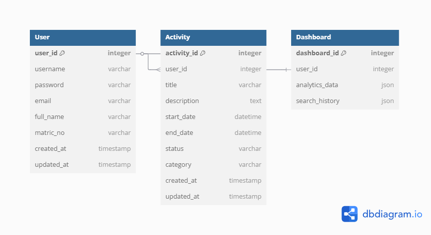
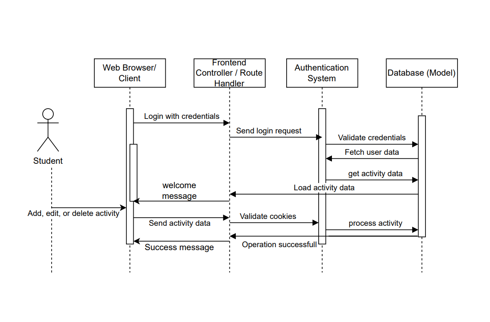

# 📄  Report and Documentation for IIUM Student Activity Tracker Website

## 📌 Project Title
**ACTIVITY TRACKER FOR IIUM STUDENT**

## 🧑‍🤝‍🧑 Group 4 Members:
| Name                     | Matric No   |
|--------------------------|-------------|
| Firdaus Muhammad Salman  | 2223281     |
| Naqash Mohd Aouf         | 2224251     |
| Muhammad Assad Iskandar  | 2217961     |
| Youssouf Adoum Abakar    | 2115185     |

## 📌 Table of Contents

1. [Introduction](#introduction)  
2. [Features](#features)  
3. [Environment Setup](#environment-setup)  
4. [Authentication](#authentication)  
5. [Routing](#routing)  
6. [Views](#views)  
7. [Controllers](#controllers)  
8. [Image Upload & Storage](#image-upload--storage)  
9. [Author](#author)  

---

## 📝 Introduction

The Student Activity Tracker is a web-based application designed to help students efficiently manage and track their extracurricular or academic activities. This system enables users to register and securely log in to a personal dashboard where they can create, view, edit, and delete their own activities. By integrating basic CRUD operations with secure authentication mechanisms, the system provides a simple and intuitive interface for users to stay organized and reflect on their participation over time. The application aims to support students in developing better self-management habits and maintaining a log of their achievements and involvements.

---

## 🎯 Objectives

 #### Support Student Engagement:
- To encourage students to actively participate in academic and extracurricular activities by providing a platform to record and reflect on their involvement.
 #### Promote Self-Management and Accountability:
- To help students take ownership of their time and responsibilities by allowing them to log and monitor their personal activities and progress.
 #### Enhance Organization and Productivity:
-  To provide students with a structured system for organizing their tasks and commitments, reducing the risk of missing deadlines or forgetting important events.
 #### Foster Digital Record Keeping:
- To offer a centralized digital space where students can securely store and manage their activity records, which can be useful for resumes, portfolios, or academic evaluations.
 #### Encourage Consistent Participation:
- To motivate students to maintain continuous engagement in university life by tracking patterns and consistency in their activities over time.

---

## ✨ Features

- 🔐 Secure Login and Registration System
- 📝 Activity CRUD (Create, Read, Update, Delete)
- 🙋‍♂️ User Profile Management (CRUD)
- 🖼️ Image Upload for Activity Documentation (if implemented)
- 📜 Middleware Protection
- 💻 Clean Blade UI with responsive layout

---

## 🛠️ Environment Setup

### Requirements

- PHP >= 8.0  
- Laravel >= 12.x  
- Sqlite Database  
- Composer  

### Installation

```bash
git clone https://github.com/your-username/student-activity-tracker.git
cd student-activity-tracker
composer install
cp .env.example .env
php artisan key:generate
php artisan migrate
php artisan serve
php artisan storage:link
```

### Entity-Relationship Diagram (ERD)



> 💡 we added the image attributes to the user and activity table, while not implementing the dashboard table in execution because its not necessary
._


### Sequence Diagram



> 💡 _This sequence diagram shows a **student** interacting with a website to perform **login** and **CRUD operations**. Requests from the **web browser** go to the **controller and route**, which communicate with the **auth system** for login and permission checks, and the **database** for data access. Responses are then returned to the browser.
._

---

## 🔑 Authentication

The authentication system is built using Laravel's built-in authentication features:

- User registration
```php
    public function store(Request $request)
    {
        $request->validate([
            'name' => 'required|string|max:255',
            'email' => 'required|string|email|max:255|unique:users',
            'password' => 'required|string|min:8|confirmed',
        ]);

        $user = User::create([
            'name' => $request->name,
            'email' => $request->email,
            'password' => $request->password, //automatic hashing
        ]);

        return redirect()->route('profile')->with('success', 'Account registered successfully!');
    }
```
- Secure login and Logout with session management
```php
    public function login(Request $request)
    {
        $credentials = $request->only('email', 'password');

        // Validate input
        $request->validate([
            'email' => 'required|email',
            'password' => 'required'
        ]);

        // Attempt to login
        if (Auth::attempt($credentials)) {
            $request->session()->regenerate();
            return redirect()->intended('/');
        }

        return redirect()->route('login')->with('error', 'Invalid email or password');
    }
```
- Protected routes using middleware

```php
/Authencticate Middleware to protect router
class Authenticate
{
    /**
     * Handle an incoming request.
     *
     * @param  \Closure(\Illuminate\Http\Request): (\Symfony\Component\HttpFoundation\Response)  $next
     */
    public function handle(Request $request, Closure $next)
    {
        if (!Auth::check()) {
            // If not logged in, redirect to /login
            return redirect()->route('login');
        }

        return $next($request);
    }
}
```

---

## 🛣️ Routing

The application uses a structured routing system organized into logical groups:

### Root Route
```php
Route::get('/', [ActivityController::class, 'index'])->middleware(Authenticate::class);
```
- Serves as the main entry point
- Protected by authentication middleware
- Redirects to login if user is not authenticated

### Authentication Routes
```php
// Login
Route::get('/login', [AuthController::class, 'index'])->name('login');
Route::post('/login', [AuthController::class, 'login']);
Route::post('/logout', [AuthController::class, 'logout']);

// Registration
Route::get('/register', [UserController::class, 'register'])->name('register');
Route::post('/register', [UserController::class, 'store'])->name('register.store');
```
- Handles user authentication flows
- Provides login, logout, and registration functionality
- Named routes for easier reference in views

### Activity Management Routes
```php
Route::middleware([Authenticate::class])->group(function () {
    Route::get('/activities', [ActivityController::class, 'displayActivities'])->name('activities');
    Route::get('/activities/add', [ActivityController::class, 'displayAdd']);
    Route::post('/activities/add', [ActivityController::class, 'addActivity'])->name('activities.store');
    Route::get('/activities/{id}', [ActivityController::class, 'viewActivity'])->name('activities.view');
    Route::post('/activities/{id}/status', [ActivityController::class, 'editActivity'])->name('activities.edit');
    Route::delete('/activities/{id}', [ActivityController::class, 'deleteActivity'])->name('activities.delete');
});
```
- All routes protected by authentication middleware
- Complete CRUD operations for activities
- RESTful design pattern for resource management

### Profile Routes
```php
Route::middleware([Authenticate::class])->group(function () {
    Route::get('/profile', [UserController::class, 'profile'])->name('profile');
    Route::get('/profile/edit', [UserController::class, 'edit']);
    Route::post('/profile/edit', [UserController::class, 'update'])->name('profile.update');
});
```
- Secure user profile management
- Allows viewing and editing user information
- Protected by authentication checks

---

## 👁️ Views

### 📋 Activities List View (activities.blade.php)

This Blade template displays a responsive table of all user activities with detailed visual status indicators and quick access features.

#### 🔍 Features:
- **Responsive Table**: Shows activity `Title`, `Description`, `Start/End Dates`, `Status`, and `Category`. Some columns hide on smaller screens for mobile-friendliness.
- **Clickable Rows**: Each activity row is clickable, redirecting to the detailed activity page via `route('activities.view', $activity->activity_id)`.
- **Status Badges**: Visually indicates activity status (`Active`, `Completed`, `Cancelled`) using color-coded badges.
- **Category Tags**: Each activity's category is labeled with a styled tag.
- **Floating Action Button (FAB)**: A "+" button fixed at the bottom-right corner opens the Add Activity form (`/activities/add`).
- **Tooltips**: Bootstrap tooltips enhance UX for interactive icons like the FAB.

--

### 📄 Activity Detail View (activity.blade.php)

This Blade template renders a detailed view of a single activity, allowing the user to manage its banner, metadata, and status.

#### 🖼️ Banner Upload
- Displays the activity's banner image or a placeholder.
- Click on the image to upload a new banner.
- Auto-submits the form when a new image is selected.

#### 📝 Activity Details
- Shows **Title**, **Description**, **Category**, **Start Date**, and **End Date**.
- Status is visually highlighted using Bootstrap badges (`active`, `completed`, `cancelled`).

#### ⚙️ Action Controls
- **Back Button**: Returns to the full activity list.
- **Status Dropdown**: Lets users update the activity's status via POST requests.
- **Delete Button**: Allows deletion with confirmation for safety.

#### 💡 Extras
- Responsive and mobile-friendly.
- Custom styling to support form actions inside dropdown menus.

--


### ➕ Add New Activity Form (add.blade.php)

This Blade view renders a responsive form for users to create and submit a new activity.

#### 🔧 Features

- **Form Fields**:
  - **Title**: Text input, required.
  - **Description**: Textarea, required.
  - **Start Date** / **End Date**: `datetime-local` inputs for event scheduling.
  - **Category**: Dropdown with predefined options (Academic, Sports, Culture, etc.).

- **Validation Handling**:
  - Displays inline error messages using Laravel's `@error` directive.
  - Retains user input with `old()` on validation failure.

- **Design**:
  - Bootstrap-based layout with responsive design.
  - Uses card components and gradient header styling for better UI.
  - Submit button styled with icons and gradient background.

- **Security**:
  - Includes `@csrf` token for form protection.

- **Submission**:
  - Sends a `POST` request to the `activities.store` route to persist new activities.
    
--


### 📊 Dashboard View (dashboard.blade.php)

This Blade view provides an interactive user dashboard that displays a summary of activity data and lists of current tasks.

#### 👋 Welcome Section

- Dynamically greets the authenticated user by name.
- Uses a gradient text effect via custom CSS for a modern visual.

#### 📈 Statistics Cards

Three summary cards show activity metrics at a glance:
- **Total Activities** (🗓️)
- **Completed Activities** (✅)
- **Upcoming Activities** (⏰)

Each card:
- Is color-coded with `border-left` highlights (primary, success, info).
- Uses Font Awesome icons for visual enhancement.

#### 🔄 Ongoing Activities Table

Displays current ongoing activities with:
- **Title**
- **Category**
- **Due Date**
- **Status**
- **Actions**:
  - **View**: Redirects to detailed activity page.
  - **Complete**: Submits form to mark the activity as completed.

Handles empty state with a friendly message and icon.

#### 🔜 Upcoming Activities Table

Displays upcoming activities similarly to the ongoing table but without the “Complete” button.

#### 🧠 Logic Summary

- Uses `@forelse` loops to gracefully handle empty results.
- Relies on data passed from the controller:
  - `$name`, `$activitiesCount`, `$completedCount`, `$upcomingCount`
  - `$ongoingActivities`, `$upcomingActivities`
- Conditional rendering for responsive UX and mobile-friendly tables.

--


 ### 📝 Edit Profile View (edit.blade.php)

This Blade template provides a clean and user-friendly form for users to update their profile information.

### 🧩 Features

- **Fields Included**:
  - `Full Name`: Required text input.
  - `Matric Number`: Optional text input.
  - `Kulliyah`: Dropdown populated from a dynamic `$kulliyahList`.
  - `Gender`: Dropdown populated from a dynamic `$genderOptions` list.
  - `Date of Birth`: `date` input with formatting.
  - `Profile Image`: Optional file upload for image.
  - `Biography`: Multi-line textarea for user's short bio.

- **Pre-filled Data**:
  - Uses `old()` and fallback values from `$name`, `$matric_number`, `$gender`, `$kulliyah`, `$dob`, `$image`, `$bio` for pre-populating the form.

- **File Upload**:
  - Enables `multipart/form-data` encoding.
  - Accepts only image files (`accept="image/*"`).
  - Displays current image filename if available.

- **Styling**:
  - Utilizes Bootstrap 5 classes for a clean and responsive layout.
  - Inline helper text shows existing image file info.

- **Security**:
  - CSRF protection using `@csrf`.

#### 📤 Form Action

- Submits data to `/profile/edit` route (likely handled in `ProfileController@edit`).
- Expected to handle validation and store updates in the database.

#### 📦 Data Binding

All fields support:
- **Old Input**: Retains values on validation failure.
- **Default Values**: Pulled from passed controller variables.

#### 🔄 Integration

Ensure the controller passes:
- `$name`
- `$matric_number`
- `$kulliyah`, `$kulliyahList`
- `$gender`, `$genderOptions`
- `$dob`
- `$image`
- `$bio`

--


### 🧱 Layout Blade: (layout.blade.php)

This is the main layout file for the **Student Activity Tracker** Laravel web application. It sets up the overall HTML structure, navigation, styling, and component placeholders using Blade templating.


#### 🧩 Key Sections

##### 📌 `<head>`
- **Bootstrap 5.3.0** for responsive design.
- **Font Awesome 6.4.0** for icons.
- **Custom CSS variables and layout**:
  - `--primary-color`: Used for navbar and buttons.
  - Background gradient and box-shadow styling.
  
##### 🔝 Navbar
- Fixed top navigation bar with the IIUM logo and links to:
  - `Dashboard` → `/`
  - `Activities` → `/activities`
  - `Profile` → `/profile`
  - `Logout` → `/logout` (uses POST with CSRF token)

##### ⛓️ Content Placeholder
- Uses `@yield('content')` to inject child views dynamically into the `<main>` tag.

##### 📥 Footer
- Dark footer with current year and app name.

##### 🛠️ Scripts
- Bootstrap Bundle (JS + Popper)
- Includes Blade `@stack('scripts')` for page-specific JavaScript.

#### ✨ Styling Highlights
- Responsive design.
- Card elements with shadow and rounded borders.
- Navigation animation on hover.
- Custom theme based on IIUM branding colors.


### 🔐 Login Blade View: (login.blade.php)
This file is the **login interface** for the **Student Activity Tracker** built with Laravel and styled using Bootstrap 5 and Font Awesome. It provides a clean and responsive user experience for user authentication.


#### 📐 Layout Overview

##### 🏗️ Structure

- **Header**: Branded with app name and icon.
- **Form**: Includes:
  - Email field
  - Password field
  - CSRF protection
  - Submit button
- **Conditional Error Alert**: Displays login errors from the session.
- **Register Link**: Navigation for users without an account.

##### 📦 Form Action

- Submits to `/login` via POST.
- Uses `@csrf` for security.
  

#### 🎨 Design & Styling

##### 🎨 Color Palette

| Element       | Color Code      | Description                        |
|---------------|------------------|------------------------------------|
| Primary Color | `#4e73df`        | Blue, used in headers/buttons      |
| Background    | `#f5f7fa → #c3cfe2` | Gradient background                |
| Shadows       | `rgba(0, 0, 0, 0.1)` | Card shadows for depth            |

##### ✨ Features

- Responsive mobile-first design.
- Floating form labels.
- Hover and focus visual effects on buttons and inputs.
- Rounded card-style login box with padding and shadow.


--


### 👤 Profile View: (profile.blade.php)

This Blade view displays a logged-in user's profile details in a clean, responsive, and well-styled card layout. It is part of the **Student Activity Tracker** system built using Laravel and Bootstrap 5.


#### 🧱 Layout Overview

- **Extends**: `layout.blade.php`
- **Main Section**: `@section('content')`
- **Conditional**: Displays content only if the user is authenticated via `Auth::check()`.


#### 📋 Displayed Information

If the user is authenticated, the following information is displayed inside a card:

| Field             | Source                          | Fallback (if null)     |
|------------------|----------------------------------|------------------------|
| Profile Picture   | `Auth::user()->profile_picture` | Default image          |
| Name              | `Auth::user()->name`            | —                      |
| Email             | `Auth::user()->email`           | —                      |
| Matric Number     | `Auth::user()->matric_number`   | `Not provided`         |
| Kulliyah          | `Auth::user()->kulliyah`        | `Not provided`         |
| Gender            | `Auth::user()->gender`          | `Not provided`         |
| Date of Birth     | `Auth::user()->dob`             | `Not provided`         |
| Bio               | `Auth::user()->bio`             | `No bio available`     |

A button is provided at the bottom to allow users to edit their profile via `/profile/edit`.

--


### 📝 Registration View: (register.blade.php)

This Blade file provides a responsive and modern UI for new users to create an account on the **Student Activity Tracker** platform.


#### 🧱 Layout Overview

- **HTML5** standard structure.
- **Title**: `Register | Student Activity Tracker`
- **CSS Libraries**:
  - Bootstrap 5.3
  - Font Awesome 6.4


#### 📦 Functional Highlights

| Feature                      | Description                                                                 |
|-----------------------------|-----------------------------------------------------------------------------|
| CSRF Protection              | Includes meta and `@csrf` token to secure the form                         |
| Form Handling                | Submits to `register.store` route (`POST`)                                 |
| Error Handling               | Displays all form validation errors using `@if ($errors->any())`           |
| Old Input Persistence        | Uses `old('field')` for sticky forms after validation errors               |
| Password Confirmation        | Includes confirmation field to prevent password typos                      |
| Redirect Link to Login       | Provides a prompt and link for users who already have an account           |


#### 📋 Form Fields

| Field Name            | Input Type | Icon                      | Validation Notes |
|----------------------|------------|---------------------------|------------------|
| `name`               | Text       | `fa-user`                 | Required         |
| `email`              | Email      | `fa-envelope`             | Required, valid  |
| `password`           | Password   | `fa-lock`                 | Required         |
| `password_confirmation` | Password | `fa-lock`              | Required         |


### ⚠️ Error Display

- Uses:
  ```blade
  @if ($errors->any())
      <ul>
          @foreach ($errors->all() as $error)
              <li>{{ $error }}</li>
          @endforeach
      </ul>
  @endif


---

## 🎮 Controllers

### 🗂️ ActivityController Functions

- **`index()`**  
  Displays the dashboard with user name, upcoming/ongoing activities, and activity statistics.

- **`displayActivities()`**  
  Shows all activities for the logged-in user.

- **`addActivity(Request $request)`**  
  Saves a new activity using input from the form and redirects to the activities page.

- **`displayAdd()`**  
  Displays the form to add a new activity.

- **`viewActivity($id)`**  
  Shows the details of a specific activity based on its ID.

- **`editActivity(Request $request, $id)`**  
  Updates the status of a specific activity.

- **`deleteActivity($id)`**  
  Deletes an activity by its ID and redirects to the activities page.

- **`uploadBanner(Request $request, $id)`**  
  Validates and uploads a new banner image for an activity.  
  Deletes the old image if it exists and updates the activity with the new image path.


### 🔐 AuthController Functions

- **`index()`**  
  Displays the login page.

- **`login(Request $request)`**  
  Validates login input and attempts to authenticate the user.  
  Redirects to the homepage if successful or back to login with an error if failed.

- **`logout(Request $request)`**  
  Logs out the user, clears the session, and redirects to the login page.


### 👤 UserController Functions

- **`profile()`**  
  Displays the user's profile page.

- **`register()`**  
  Shows the registration form.

- **`store(Request $request)`**  
  Validates registration input and creates a new user.  
  Redirects to profile on success.

- **`edit()`**  
  Loads the profile edit form with current user data and options for gender and kulliyah.

- **`update(Request $request)`**  
  Validates and updates the user's profile data, including image upload if provided.

---

## 🖼️ Image Upload & Storage

```php
public function uploadBanner(Request $request, $id)
    {
        $request->validate([
            'banner_image' => 'required|image|mimes:jpg,jpeg,png|max:2048',
        ]);

        $activity = Activity::where('activity_id', $id)->firstOrFail();

        // Delete old banner if exists
        if ($activity->banner_image && Storage::exists('public/' . $activity->banner_image)) {
            Storage::delete('public/' . $activity->banner_image);
        }

        $file = $request->file('banner_image');
        $path = $file->store('images', 'public');
        $path = 'storage/' . $path;
        $path = url($path);

        $activity->banner_image = $path;
        $activity->save();

        return redirect()->back()->with('success', 'Banner uploaded successfully.');
    }
}
```

The system uses Laravel's file storage system to handle profile and activity banner images securely and efficiently.

### 🔐 Secure Upload & Validation
- All uploaded images are validated (`jpg`, `jpeg`, `png`, max 2MB).
- Prevents invalid or malicious files from being stored.
- Enforces correct MIME types and file size restrictions.

### 🔄 Auto File Replacement
- When users or activities update their images, old files are deleted from storage to save space and avoid clutter.
- Unique filenames are generated using Laravel's `hashName()` to avoid conflicts.

### 🗂️ Organized Storage
- Images are saved in the `public/images` directory using Laravel’s `Storage` facade.
- Profile pictures: `public/images/filename.jpg`
- Activity banners: `public/images/filename.jpg`

### 🌐 Public Access to Approved Images
- Uploaded images are converted into public URLs (`storage/images/...`) using `url()` helper.
- These links are safely displayed in views, such as user profiles and activity detail pages.

### 🛠️ Code Integration

```php
public function update(Request $request)
    {
        $user = Auth::user();

        $validatedData = $request->validate([
            'name' => 'required|string|max:255',
            'matric_number' => 'nullable|string|max:20',
            'kulliyah' => 'nullable|string|in:ICT,ENGIN,EDUC,LAWS,ENMS,ARCHI', // Validate against allowed values
            'gender' => 'nullable|string|in:Male,Female', // Restrict to valid options
            'dob' => 'nullable|date|before:today', // Ensure date is in the past
            'bio' => 'nullable|string|max:500', // Allow optional bio with max 500 characters
            'image' => 'nullable|image|max:2048',
        ]);

        if ($request->hasFile('image')) {
            $uploadedFile = $request->file('image');
            $filename = $uploadedFile->hashName(); // Generate a unique filename

            if ($user->profile_picture) { // Check if the user already has a profile picture
                // Remove 'images/' if it's part of the stored path
                $oldImagePath = str_replace('images/', '', $user->profile_picture);
                $oldImagePath = 'public/images/'. $oldImagePath;

                if (Storage::exists($oldImagePath)) {
                    Storage::delete($oldImagePath);
                }
            }

            $path = $uploadedFile->storeAs('public/images', $filename);
            $validatedData['profile_picture'] = $filename;
        }

        try {
            $user->update($validatedData);
            return redirect()->route('profile')->with('success', 'Profile updated successfully!');
        } catch (\Exception $e) {
            return back()->withInput()->withErrors(['error' => 'Failed to update profile.']);
        }
    }
}
```

**UserController - Profile Picture Upload**
- Handles optional image upload during profile update.
- Deletes old profile image if a new one is uploaded.

**ActivityController - Banner Image Upload**
- Validates and uploads banner images for activities.
- Deletes old banners and updates the activity record with the new image path.


---

## 👨‍💻 Author & Contributions

Developed by Group 4 for INFO 3308, Web Application Development Class, International Islamic University Malaysia, Semester 1 2023/2024.

| Name                     | Matric No   | Contributions                                         |
|--------------------------|-------------|----------------------------------------------------- |
| Firdaus Muhammad Salman  | 2223281     | All Login, Register and Activities views, controller, routes, and Middleware.|
| Naqash Mohd Aouf         | 2224251     | Profile page view, controllers and routes |
| Muhammad Assad Iskandar  | 2217961     | Edit page view, routes                    |
| Youssouf Adoum Abakar    | 2115185     | |

---
