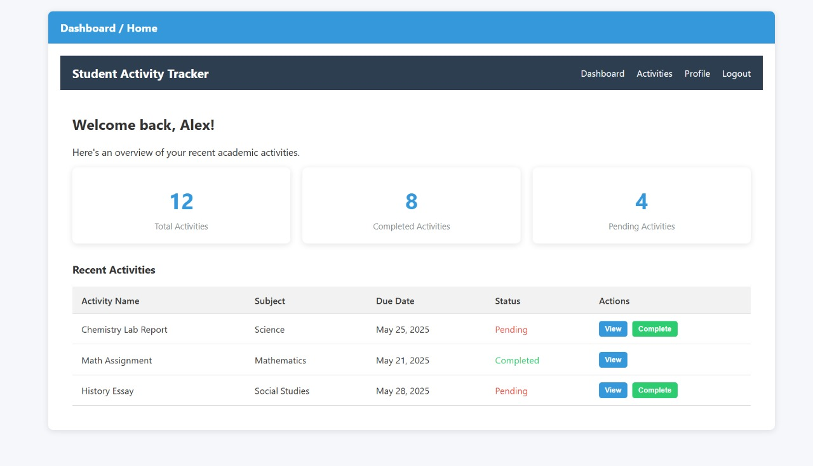

# 📄  Report and Documentation for IIUM Student Activity Tracker Website

## 📌 Project Title
**ACTIVITY TRACKER FOR IIUM STUDENT**

## 🧑‍🤝‍🧑 Group 4 Members:
| Name                     | Matric No   |
|--------------------------|-------------|
| Firdaus Muhammad Salman  | 2223281     |
| Naqash Mohd Aouf         | 2224251     |
| Muhammad Assad Iskandar  | 2217961     |
| Youssouf Adoum Abakar    | 2115185     |

## 📌 Table of Contents

1. [Introduction](#introduction)  
2. [Features](#features)  
3. [Environment Setup](#environment-setup)  
4. [Authentication](#authentication)  
5. [Routing](#routing)  
6. [Views](#views)  
7. [Controllers](#controllers)  
8. [Image Upload & Storage](#image-upload--storage)  
9. [Author](#author)  
10. [License](#license)

---

## 📝 Introduction

This project is a student activity tracker specifically tailored for IIUM students. It allows users to:
- Register and log in to the system.
- Create, view, edit, and delete their activity records.
- Manage their personal profile and activity statuses.

---

## ✨ Features

- 🔐 Secure Login and Registration System
- 📝 Activity CRUD (Create, Read, Update, Delete)
- 🙋‍♂️ User Profile Management
- 🖼️ Image Upload for Activity Documentation (if implemented)
- 📜 Role-based Middleware Protection
- 💻 Clean Blade UI with responsive layout

---

## 🛠️ Environment Setup

### Requirements

- PHP >= 8.0  
- Laravel >= 10.x  
- MySQL or PostgreSQL  
- Composer  
- Node.js & NPM (if frontend assets are managed)

### Installation

```bash
git clone https://github.com/your-username/student-activity-tracker.git
cd student-activity-tracker
composer install
cp .env.example .env
php artisan key:generate
php artisan migrate
php artisan serve
php artisan storage:link


# 📄  Proposal for Student Activity Tracker Website

## 📌 Project Title
**ACTIVITY TRACKER FOR IIUM STUDENT**

## 🧑‍🤝‍🧑 Group 4 Members:
| Name                     | Matric No   |
|--------------------------|-------------|
| Firdaus Muhammad Salman  | 2223281     |
| Naqash Mohd Aouf         | 2224251     |
| Muhammad Assad Iskandar  | 2217961     |
| Youssouf Adoum Abakar    | 2115185     |

## 📝 Introduction

The Student Activity Tracker is a web-based application designed to help students efficiently manage and track their extracurricular or academic activities. This system enables users to register and securely log in to a personal dashboard where they can create, view, edit, and delete their own activities. By integrating basic CRUD operations with secure authentication mechanisms, the system provides a simple and intuitive interface for users to stay organized and reflect on their participation over time. The application aims to support students in developing better self-management habits and maintaining a log of their achievements and involvements.


## 🎯 Objectives

 #### Support Student Engagement:
- To encourage students to actively participate in academic and extracurricular activities by providing a platform to record and reflect on their involvement.
 #### Promote Self-Management and Accountability:
- To help students take ownership of their time and responsibilities by allowing them to log and monitor their personal activities and progress.
 #### Enhance Organization and Productivity:
-  To provide students with a structured system for organizing their tasks and commitments, reducing the risk of missing deadlines or forgetting important events.
 #### Foster Digital Record Keeping:
- To offer a centralized digital space where students can securely store and manage their activity records, which can be useful for resumes, portfolios, or academic evaluations.
 #### Encourage Consistent Participation:
- To motivate students to maintain continuous engagement in university life by tracking patterns and consistency in their activities over time.


## 🔧 Features and Functionalities

- **User Authentication**: Users can register, log in to their accounts, and log out securely.
- **Create**: Users can add a new activity entry to their personal list.
- **Read**: Users can view a list of their activities and see detailed information for each entry.
- **Update**: Users can edit the details of any existing activity entry, Also editing their personal information in the Account.
- **Delete**: Users can either mark an activity as done or permanently delete it from their list.
- **Dashboard**: Manage users, view analytics, and moderate content, and search.


## 🗃️ Entity-Relationship Diagram (ERD)


*Figure 1: Database schema showing relationships between Users, Activities, and Dashboard*


## 🔁 Sequence Diagram


> 💡 _This sequence diagram shows a **student** interacting with a website to perform **login** and **CRUD operations**. Requests from the **web browser** go to the **controller and route**, which communicate with the **auth system** for login and permission checks, and the **database** for data access. Responses are then returned to the browser.
._


## 🖼️ Mockup Design

You can preview the static HTML/CSS mockup of the Student Activity Tracker at the following link:

👉 [**View Mockup Here**](https://salmanfrds.github.io/SAT_Mockup/)



> 💡 _This mockup was built using static HTML and CSS to represent the layout and flow of the web application pages (e.g., login, activity list, add/edit activity)._


## 📚 References

- [Laravel Documentation](https://laravel.com/docs)
- [Bootstrap Documentation](https://getbootstrap.com/)
- [dbdiagram.io - ERD Tool](https://dbdiagram.io/)
- [Markdown Guide](https://www.markdownguide.org/)

---
